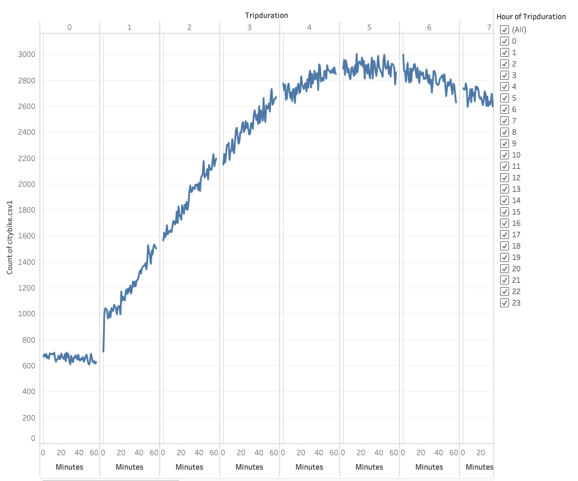
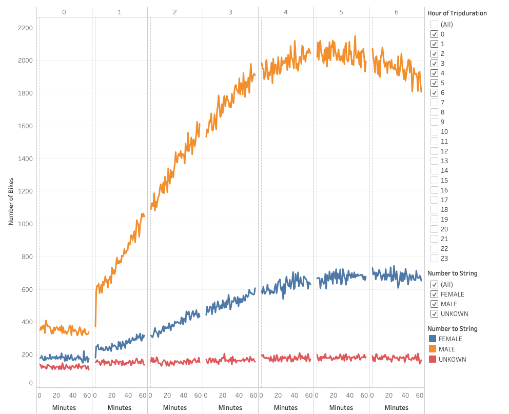
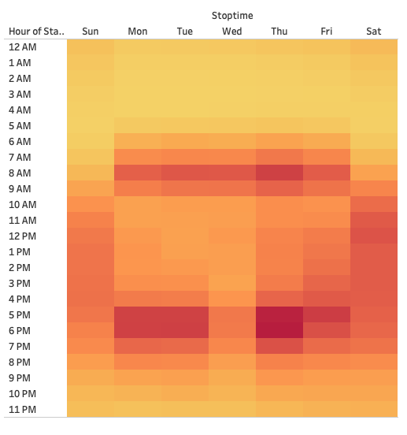
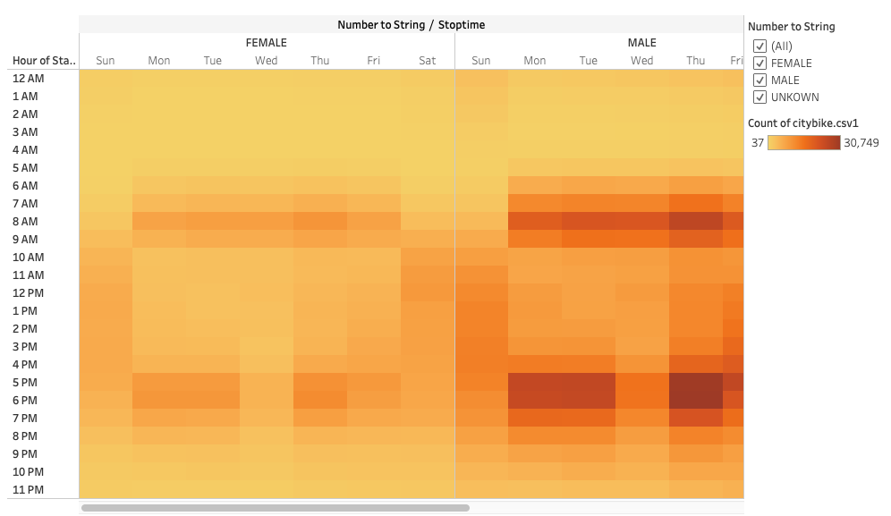
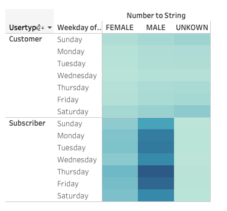
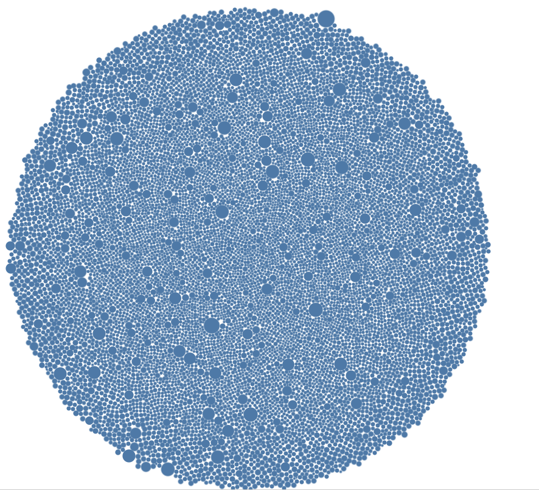
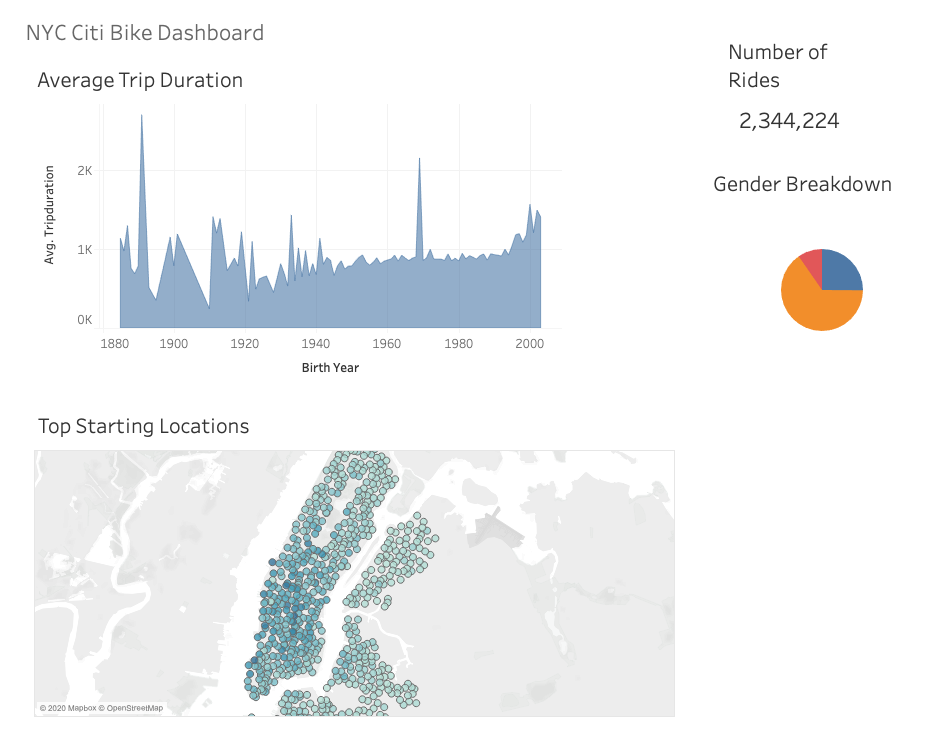
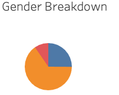
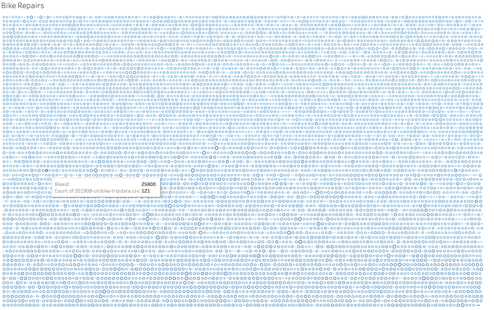

# Bikesharing
Christopher Padilla Gregorio

# Overview 
  The point of this project is to use Tableau to create visuals that would convice investors that the program Des Moines is a solid business proposal.
  
  # Results 
  
  
  The Image above demostrates the length of time that each bike were checked out by all users
  
  
  
  This Image shows the length of time of each bike were checkout by gender
  
  
  
  This heatmap shows the number of bike trips by weekday for each hour of the day.
  
  
  
  This heatmap shows the number of bike trips by gender for each hour of the day.
  
  
  
  Relating to the pervious heatmap, this one demostrates the number of bike trips by gender for each hour for each day of the week.
  
  
  
  This plot shows the bike utilization levels.
  
  
  
  This is a couple of bike sharing information for the city of NEW YORK
  
  # Summary 
  The following information gathered, can give investors the confidence that the project of Des Moines is a solid business proposal. Each of the following plots shows that the bike sharing project has significant amount of popularity. However, it should be noted that additional inforamtion such as frequency of bike riders during the each season and most frequent departure area. These additional information would give investors that extra bit on confidence about the project.
Two additional plots will be added to show the diversity of riders per gender and frequency of repairs. 

